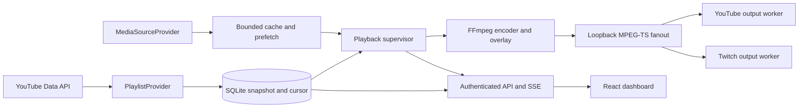

# IdleCast 1.0.0 architecture

## Goals and boundaries

Single-owner Linux service: Node 24, SQLite WAL, React/TypeScript/Tailwind, FFmpeg. The primary workflow is a YouTube playlist link. The official YouTube Data API supplies metadata/order only. A replaceable, explicitly experimental yt-dlp adapter supplies media; local media is optional.

## Implementation order

Repository architecture → validated configuration → official YouTube pagination → SQLite persistence → process manager → provider/output boundaries → overlay → dashboard → Docker → tests → README. Later reliability review added shared encoder options and standby playout.

## Provider interfaces

- **PlaylistProvider.fetch:** returns a complete ordered snapshot or rejects. Full pagination precedes any database mutation. Playlist item IDs preserve duplicate videos. videos.list supplies duration and missing/private availability.
- **MediaSourceProvider.resolve:** returns a playable local file and supports cancellation; optional pin keeps the playing file from eviction. The YouTube adapter serializes downloads, deduplicates in-flight requests, prefetches the next item, and enforces a monitored cache budget. Provider replacement is constructor injection in Engine.
- **StreamOutputProvider.args:** returns destination-specific worker arguments. YouTube/Twitch workers use independent RTMPS keys and official endpoint validation. Tests substitute local outputs without account traffic.

## Playback and recovery

A single supervisor selects the durable cursor identity, seeks to the checkpoint, skips unavailable or cooling-down items, and loops. Checkpoints use encoded frame count every five seconds, so globally offset stream timestamps do not corrupt the per-item cursor.

Each item is normalized to 720p H.264/AAC MPEG-TS and fanned out over loopback UDP to persistent copy-only FFmpeg workers. A monotonic session offset bridges encoders; workers regenerate timestamps. UDP buffers bound slow-destination backpressure. Output failures retry at 1/2/4/8/16/30 seconds, capped at 30 seconds. Media and output progress watchdogs terminate stalled children.

A branded standby encoder runs during slow preparation or when all items are unavailable. Switching waits for the old encoder to stop before starting another. Transitions may contain short gaps; this is not frame-perfect playout. No automatic claim of live viewer visibility is made.

Explicit Stop clears desired playback; shutdown preserves it. Startup resumes when desired and configured. Child processes are launched without a shell, with bounded timeouts. Linux process groups allow cancellation of yt-dlp's FFmpeg children. The data-directory PID guard rejects another active owner and handles self-PID reuse on container restart.

## Persistence

Migration 1 creates settings/recovery key-value storage, ordered items, bounded logs, and hashed sessions. PRAGMA user_version guards newer databases; migrations run transactionally. Playlist replacements use a temporary identity table in one transaction. Failed syncs preserve the prior snapshot and cursor. Removed current items finish their resolved file, then the supervisor chooses from the new snapshot.

SQLite WAL, busy timeout and foreign-key enforcement are enabled. One process owns the database. Logs retain 1,000 entries. An admin backup must include consistent database state; use the stopped-service procedure in operations.md.

## Security

One environment-configured owner password, scrypt verification, random opaque session tokens stored only as SHA-256 digests, HttpOnly SameSite Strict cookies, exact Origin checks on writes, and bounded login throttling. Sessions expire in 24 hours and are cleared at startup.

Only credential-presence booleans reach the UI. Third-party stdout/stderr is bounded or discarded; raw commands and stream URLs are never logged. Restrict ingest hosts, ports and path shapes so secrets cannot accidentally be pasted into persisted server URLs. Realpath checks contain local files and avatars. TLS reverse proxy or SSH tunnel is required for remote use.

The trusted-host boundary includes host administrators and the service account, which can inspect process arguments and environment. No multi-user isolation is promised.

## Resource tradeoffs

One encode, two remux workers, next-video prefetch, 720p30 at 2500 kbps. Standby only starts after a one-second preparation delay. No media upload server, distributed queue, Redis, transcoding farm, or browser video preview. The metadata API is paged, and the browser virtualizes rows but retains its fetched metadata array.

## Layout

- server/config.ts: environment/settings validation and playlist-link parsing
- server/providers.ts: metadata, media and output adapters
- server/db.ts: migration, snapshots, recovery and diagnostics
- server/process.ts: bounded subprocesses, cancellation and backoff
- server/encoder.ts and overlay.ts: FFmpeg options, standby and identity overlay
- server/engine.ts: serialized playback and independent outputs
- server/app.ts and index.ts: authenticated API/SSE and lifecycle
- web/: responsive dashboard
- tests/: unit/API, real FFmpeg and browser verification
